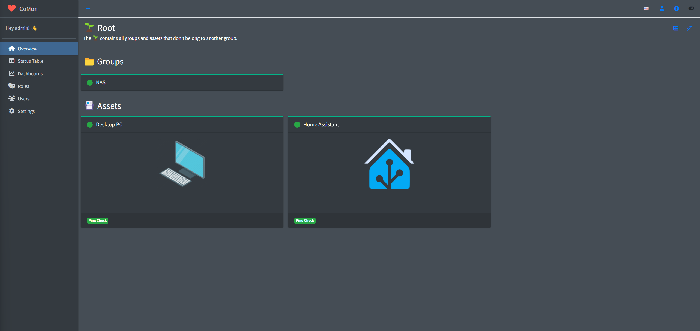

# CoMon

A simple tool for Condition Monitoring.

> [!IMPORTANT]  
> This project was primarily developed for learning purposes. It is unknown how the future of this project will look like.



## Features

- Create assets with monitoring packages to monitor ping and http(s) endpoints
- Cluster assets to groups
- Receive package status updates via the [CoMon Python Package](https://github.com/hchris1/CoMonPython)
- Create dashboards from groups, assets and packages
- White- and darkmode


## Installation

#### Docker

```bash
docker run -d --restart=always -p 8080:8080 -v comon:/data --name comon hchris1234/comon:latest
```

CoMon will be available at `http://localhost:8080`. You can login with the default user `admin` and password `123qwe`.

#### Home Assistant

Use the [Home Assistant Community Add-on: CoMon](https://github.com/hchris1/Addon-CoMon).
